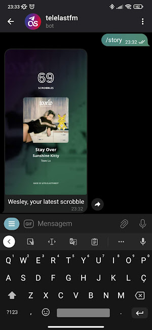

<header>

<h1 style="display: inline">telelastfm</h1>

Telegram bot that provides music statistics for you and your friends from LastFM

</header>

## About

A Telegram bot that provides music stats for you and your LastFM friends, customizes artist names and generates collages with top songs, albums and artists

## Usage

Available commands:

- `/ln` Track you're scrobbling
- `/alb` Album you're scrobbling
- `/art` Artist you're scrobbling
- `/reg` Set your LastFm's username
- `/addn` Set artist's nick for a chat
- `/rmvn` Remove artist's nick for a chat
- `/collage` Generate a grid collage
- `/top` Generate a top scrobbles collage
- `/story` Generate a image of your latest scrobble

## Screenshots

  
  
  

## Additional information

- [Telegram channel](https://t.me/telelastfmnews) with the bot's updates and more.
